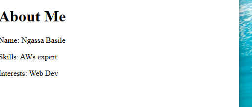

# Portfolio Project

## Description
This portfolio project is a showcase of my skills, interests, and projects. It highlights my journey as a developer and includes various sections about me and my work.

## Features
- About Me section with detailed information about my skills and interests.
- A professional layout designed to present my work effectively.
- Fully responsive web pages.

## Navigation
1. **About Me**: Learn more about my background, skills, and interests by visiting the `about.html` page.
2. **Portfolio**: View my projects and work samples on the portfolio page.
3. **Contact**: Reach out to me using the contact information provided.

## Screenshot
Here is a screenshot of the project folder structure:  


## How to Access the Project
1. Clone the repository:  
   ```bash
   git clone <repository_url>
